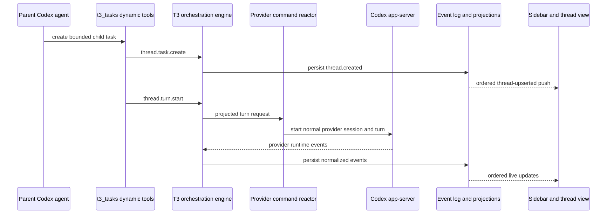

# Agent-controlled tasks

T3 Code Orchestrator lets a Codex thread create and control normal, user-owned T3 threads. These
tasks are not Codex collaboration subagents: they use the same domain commands, event log,
projections, provider reactors, persistence, and ordered shell pushes as threads created in the UI.



## Integration choice

Codex dynamic tools are the smallest integration because the existing Codex app-server protocol
already supports `dynamicTools` on `thread/start` and `item/tool/call` requests. The server
advertises the `t3_tasks` namespace on custom Codex sessions and rechecks persisted authorization on
every call. This avoids another local MCP process and keeps ownership decisions inside T3.

When orchestration is enabled, every Codex turn sets a custom `multiAgentMode` that forbids
provider-native hidden subagents and requires delegation through `t3_tasks`. The current persisted
flag is sent on every turn, so changing it affects an existing provider session without restart.

## Tool contracts

The Codex namespace is `t3_tasks`. Each call returns a Codex dynamic-tool response containing one
JSON `inputText` item. Success responses set `success: true`; failures set `success: false` and
return `{ "error": { "code": "...", "message": "..." } }`.

| Tool                     | Input                                                                                                                                             | Result                                                                                                                                       |
| ------------------------ | ------------------------------------------------------------------------------------------------------------------------------------------------- | -------------------------------------------------------------------------------------------------------------------------------------------- |
| `t3_tasks.create`        | `tasks` (root: 1–10; child: 1–4): `prompt`; optional `title`, `projectId`, `workspacePath`, `model`, `reasoningEffort`, `pinned`, `workspaceMode` | Created T3 IDs, title, parent/root, depth, workspace mode, initial status, model/effort, pin, and provider/runtime ID when already available |
| `t3_tasks.list`          | optional `status`                                                                                                                                 | Compact summaries of direct children created by this orchestrator                                                                            |
| `t3_tasks.read`          | `threadId`; optional `cursor`, `limit` (1–20)                                                                                                     | Bounded messages, current summary, `nextCursor`, live-tail `outputToken`, and truncation flag                                                |
| `t3_tasks.wait`          | `tasks` (1–4) with `threadId`, optional cursor and `outputToken`; optional `timeoutSeconds` (0–60)                                                | Returns on status/output change or timeout, with status, cursors, and output tokens                                                          |
| `t3_tasks.message`       | `threadId`, `message`                                                                                                                             | New projected turn ID and status; rejects a task that is still active                                                                        |
| `t3_tasks.interrupt`     | `threadId`                                                                                                                                        | Safe turn-interrupt request; never archives or deletes                                                                                       |
| `t3_tasks.pin`           | `threadId`, `pinned`                                                                                                                              | Persisted pin state                                                                                                                          |
| `t3_tasks.orchestration` | `threadId`, `enabled`                                                                                                                             | Root-only enable/disable result for an owned direct child                                                                                    |

`workspaceMode` defaults to `isolated`; `shared` must be explicit. Supplied project and workspace
values must exactly match the caller's saved project and effective checkout. Example:

```json
{
  "tasks": [
    {
      "prompt": "Add focused parser tests.",
      "title": "Parser tests",
      "model": "gpt-5.6-sol",
      "reasoningEffort": "low"
    },
    {
      "prompt": "Review the parser contract only.",
      "workspaceMode": "shared",
      "pinned": true
    }
  ]
}
```

Incremental monitoring passes the cursor returned by `read` or `wait`:

```json
{
  "tasks": [
    {
      "threadId": "thread-id-a",
      "cursor": 4,
      "outputToken": "opaque-token-returned-by-read-or-wait"
    },
    { "threadId": "thread-id-b", "cursor": 2 }
  ],
  "timeoutSeconds": 30
}
```

A completed message advances the numeric transcript cursor. A streaming tail keeps its cursor
position and returns an opaque `outputToken`; passing both values to `wait` wakes on later deltas.
The next `read` repeats only that bounded live tail, not the full transcript, and advances after the
message completes.

## Domain and persistence

`thread.task.create` is an internal command. WebSocket clients cannot forge it. The decider verifies
that the parent exists, is active, opted in, belongs to the requested project, and supplies the
expected root and depth. It emits the ordinary `thread.created` event. The provider command reactor
then handles the ordinary `thread.turn.start` request.

Each created thread persists:

- `taskRelation`: parent thread, root thread, depth, workspace mode, and `createdBy: "agent"`;
- `taskOrchestrationEnabled`: enabled for depth-1 children and disabled for depth-2 children, so
  permission propagates for one generation only;
- `pinned`, which is also available to normal threads.

Migration 035 stores the permission, relation JSON, indexed parent ID, and pin. Legacy events and
snapshots decode with disabled/null/unpinned defaults.

## Authorization and limits

Root threads allow orchestration by default. Newly created depth-1 child tasks also allow
orchestration by default, so they can create the permitted depth-2 generation. Depth-2 tasks start
disabled. Calls made while disabled return `permission_denied`.

The service accepts only direct child tasks created by the calling orchestrator in the same project.
Guessed IDs, the caller itself, ancestors, siblings, and unrelated threads return
`ownership_denied`. Current bounds are:

- maximum root create batch and active direct children: 10;
- maximum depth-1 child create batch and active direct children: 4 per child;
- maximum relationship depth: 2;
- maximum wait: 60 seconds;
- maximum incremental read: 20 messages and 12,000 characters.

Model and reasoning choices are validated against models and option descriptors advertised by the
active provider instance. Omitting both inherits the parent's normal selection; selecting another
model without an effort leaves that model's provider default intact. Tool results are bounded
projections and never include credentials, provider environment values, or approval secrets.
Existing runtime, sandbox, interaction, and approval policies are copied without widening
permissions.

## Workspace modes

`shared` uses the saved project's current effective checkout. It creates no branch, worktree, merge,
reset, clean, or automatic cleanup. Results include a warning because simultaneous write-capable
tasks can conflict.

`isolated` uses the existing `GitWorkflowService` to create a normal temporary T3 worktree and
branch. The path is platform-resolved. A newly created worktree is rolled back only if task
registration/start fails before ownership is handed to the task; successful task work is never
merged or removed automatically.

Parentage is domain metadata and does not depend on Git branches. A child may be given orchestration
permission later, but still remains subject to depth and concurrency limits.

## UI

Created tasks arrive through the shell stream, so both sidebars update without refresh. Rows reuse
normal running/completed/failed/interrupted state presentation and add restrained task and pin
indicators. Pinned rows sort first within their current lifecycle section. Opening a task uses the
normal thread route; its header can navigate back to the parent.

Web/desktop and mobile group task relations into a visual tree under the root thread's lifecycle
section. Descendants use compact rows while keeping their own settle, un-settle, or wake action.
Users can show a child as a visual root and later re-nest it; this preference is client-local and
does not change orchestration ownership. Settling a visual root processes descendants deepest-first,
wakes snoozed descendants before settling them, and settles the root last.

Supported Codex thread headers expose the persisted orchestration state and allow both enabling and
disabling it. Root thread context usage also includes an aggregate over measured descendants;
missing capacity on any measured task suppresses the aggregate percentage instead of presenting a
partial limit as complete.

## Testing

Focused tests cover contracts, decider invariants, event projection, database reload, client replay,
dynamic tool protocol handling, permission and ownership, bounds, model validation, cursor reads and
waits, messaging, interruption, pinning, workspace warnings, and isolated-worktree failure handling.
